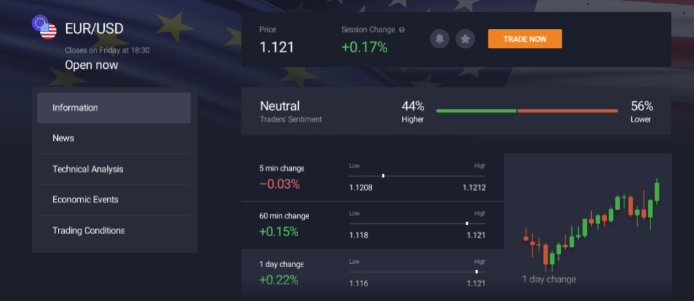
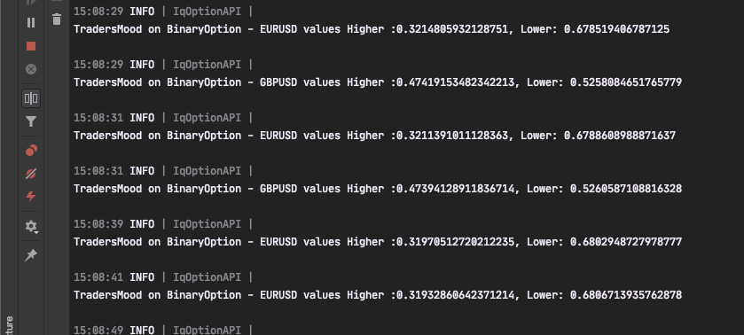

# IqOption.Net

IqOption Api to connect to www.iqoption.com (unofficial), with .netcore based for another framework you can suggest,
Now we can talk about the issue on gitter here

[](https://gitter.im/Iqoption-Net/community?utm_source=badge&utm_medium=badge&utm_campaign=pr-badge)

|           Branch           |                                                                                         Build                                                                                          |                                                                    Nuget                                                                     |
| :------------------------: | :------------------------------------------------------------------------------------------------------------------------------------------------------------------------------------: | :------------------------------------------------------------------------------------------------------------------------------------------: |
|         **master**         | [](https://ci.appveyor.com/project/MongkonEiadon/iqoption-net-06742/branch/master) |                   [](https://www.nuget.org/packages/iqoptionapi/)                   |
| **developer(Pre-release)** |   [](https://ci.appveyor.com/project/MongkonEiadon/iqoption-net/branch/develop)   | [](https://www.nuget.org/packages/iqoptionapi/2.0.0-alpha1) |

# Package Installation

```javascript
PM> Install-Package IqOptionApi

```

# How it work

This api using websocket to communicate realtime-data to IqOption server through secured websocket channel, so the realtime metadata that come on this channel will be handles by .net reactive programming called "Rx.NET", cause of a haundred of data type stream on only one channle so we need to selected subscribe on specific topic.

# Milestone

- BuyBack Position
- Subscribe to the channel
- support open Long/Short for CFD contract (Digital Options)

# How to use

```csharp
var client = new IqOptionApi("emailaddress", "password");

//begin connect
if(await client.ConnectAsync()){

  //get user profile
  var profile = await client.GetProfileAsync();

  // open order EurUsd in smallest period (1min)
  var exp = DateTime.Now.AddMinutes(1);
  var buyResult = await api.BuyAsync(ActivePair.EURUSD, 1, OrderDirection.Call, exp);

  // get candles data
  var candles = await api.GetCandlesAsync(ActivePair.EURUSD, TimeFrame.Min1, 100, DateTimeOffset.Now);
  _logger.LogInformation($"CandleCollections received {candles.Count}");


  // subscribe to pair to get real-time data for tf1min and tf5min
  var streamMin1 = await api.SubscribeRealtimeDataAsync(ActivePair.EURUSD, TimeFrame.Min1);
  var streamMin5 = await api.SubscribeRealtimeDataAsync(ActivePair.EURUSD, TimeFrame.Min5);

  streamMin5.Merge(streamMin1)
      .Subscribe(candleInfo => {
          _logger.LogInformation($"Now {ActivePair.EURUSD} {candleInfo.TimeFrame} : Bid={candleInfo.Bid}\t Ask={candleInfo.Ask}\t");
  });

  // after this line no-more realtime data for min5 print on console
  await api.UnSubscribeRealtimeData(ActivePair.EURUSD, TimeFrame.Min5);

}

```

## Example Use Cases

This is example use cases that this api could solve your problems

### Trading follower

```csharp
public async Task TradingFollower_ExampleAsync() {

    var trader = new IqOptionClient("a@b.com", "changeme");
    var follower = new IqOptionClient("b@c.com", "changeme");

    await Task.WhenAll(trader.ConnectAsync(), follower.ConnectAsync());

    trader.WsClient.OpenOptionObservable().Subscribe(x => {
        follower.BuyAsync(x.Active, (int) x.Amount, x.Direction, x.ExpirationTime);
    });
}
```

## BuyAsync

To open turbo-option within (1M-5M) duration

```csharp
var api = new IqOptionApi("email@email.com", "passcode");

try {
    //logging in
    if (await api.ConnectAsync()) {
        //open order EurUsd in smallest period(1min)
        var exp = DateTime.Now.AddMinutes(1);
        await api.BuyAsync(ActivePair.EURUSD, 1, OrderDirection.Call, exp);
    }
}
catch (Exception ex) {
    Console.WriteLine(ex.Message);
}
finally {
    Console.ReadLine();
}

```

## TradersMood

To check traders mood on specific Instrument/ActivePair


```csharp
var api = new IqOptionApi("email@email.com", "passcode");

try {
    //logging in
    if (await api.ConnectAsync()) {

        // call the subscribe to listening when mood changed
        api.WsClient.TradersMoodObservable().Subscribe(x => {

            // values goes here
            _logger.Information(
                $"TradersMood on {x.InstrumentType} - {x.ActivePair} values Higher :{x.Higher}, Lower: {x.Lower}"
            );
        });

        // begin subscribe 2 pairs
        api.SubscribeTradersMoodChanged(InstrumentType.BinaryOption, ActivePair.EURUSD);
        api.SubscribeTradersMoodChanged(InstrumentType.BinaryOption, ActivePair.GBPUSD);

        //wait for 10 secs
        await Task.Delay(10000);

        // after unsubscribe GBPUSD moods will not come anymore
        api.UnSubscribeTradersMoodChanged(InstrumentType.BinaryOption, ActivePair.GBPUSD);
    }
}
catch (Exception ex) {
    Console.WriteLine(ex.Message);
}
finally {
    Console.ReadLine();
}

```



### Copy Trade

now using ReactiveUI way for subscribe the changing of model following this

```csharp

    var trader = new IqOptionClient("a@b.com", "changeme");
    var follower = new IqOptionClient("b@c.com", "changeme");

    await Task.WhenAll(trader.ConnectAsync(), follower.ConnectAsync());

    trader.WsClient.OpenOptionObservable().Subscribe(x => {
        follower.BuyAsync(x.Active, (int) x.Amount, x.Direction, x.ExpirationTime);
    });

```

# Support Me

If you've got value from any of the content which I have created, but pull requests are not your thing, then I would also very much appreciate your support by buying me a coffee.

<a href="https://www.buymeacoffee.com/6VF3XHb" target="_blank"></a>
